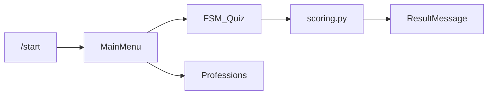

  ---
name: Структура aiogram-бота
overview: "Создать модульную структуру Python-проекта с aiogram 3.x для телеграм-бота профориентации школьников: конфигурация, роутеры, FSM для опроса, клавиатуры, данные (профессии/вопросы) и минимальные заглушки кода для запуска."
todos:
  - id: scaffold-root
    content: Добавить requirements.txt, .env.example, .gitignore, run.py
    status: pending
  - id: scaffold-bot-core
    content: Создать bot/config.py, bot/main.py с Bot, Dispatcher, MemoryStorage, polling
    status: pending
  - id: scaffold-handlers
    content: Создать handlers (common + orientation), keyboards, states, подключить роутеры
    status: pending
  - id: scaffold-data-services
    content: Добавить data/*.json с примером вопросов/профессий и services/scoring.py
    status: pending
isProject: false
---

# Структура проекта: Telegram-бот профориентации (aiogram 3)

## Контекст

Рабочая папка [d:\botAIproforintetion](d:\botAIproforintetion) сейчас без прикладного кода (есть `.venv`). Предлагается **пакет `bot/` в корне репозитория** — привычная схема для небольших ботов без лишней вложенности `src/`.

## Целевая структура каталогов и файлов

```text
d:\botAIproforintetion\
├── .env.example                 # BOT_TOKEN=..., без секретов в git
├── .gitignore                   # .env, __pycache__, .venv, *.db
├── requirements.txt             # aiogram>=3, python-dotenv (опционально pydantic-settings)
├── run.py                       # тонкая точка входа: asyncio + main()
└── bot/
    ├── __init__.py
    ├── main.py                  # создание Bot/Dispatcher, подключение роутеров, polling
    ├── config.py                # загрузка токена из env
    ├── handlers/
    │   ├── __init__.py          # сборка router: include_router(...)
    │   ├── common.py            # /start, /help, «Главное меню»
    │   └── orientation.py       # сценарий профориентации: кнопки, шаги опроса, итог
    ├── keyboards/
    │   ├── __init__.py
    │   ├── reply.py             # ReplyKeyboard: главное меню
    │   └── inline.py            # InlineKeyboard: варианты ответов, «назад»
    ├── states/
    │   ├── __init__.py
    │   └── orientation.py       # FSM: группа состояний опроса (шаги вопросов)
    ├── middlewares/
    │   └── __init__.py          # заготовка (позже: антиспам, логирование)
    ├── services/
    │   ├── __init__.py
    │   └── scoring.py           # подсчёт «склонностей» по ответам → текст рекомендации
    └── data/
        ├── professions.json     # краткие описания направлений (читать через json)
        └── quiz_questions.json  # вопросы и варианты с весами/тегами для scoring
```

## Назначение блоков под задачу «профориентация для школьников»


| Часть                     | Роль                                                                                                   |
| ------------------------- | ------------------------------------------------------------------------------------------------------ |
| `handlers/common.py`      | Дружелюбное приветствие, возрастной тон, меню: «Узнать о профессиях», «Пройти тест», «Полезные ссылки» |
| `handlers/orientation.py` | Запуск опроса по FSM, обработка ответов, показ итога и советов                                         |
| `states/orientation.py`   | Чёткие шаги (например: интересы → предметы → формат работы → результат)                                |
| `services/scoring.py`     | Отделение логики от хендлеров: по ответам выбрать 1–3 направления из `data/`                           |
| `data/*.json`             | Контент без перекомпиляции: легко править тексты и вопросы педагогу/методисту                          |


## Технические решения (aiogram 3)

- **Router** на модуль: в `handlers/__init__.py` объединить `common` и `orientation`.
- **FSM**: `MemoryStorage` для старта; в плане на будущее — замена на Redis, если бот пойдёт в прод с несколькими воркерами.
- **Конфиг**: переменная окружения `BOT_TOKEN` ([bot/config.py](bot/config.py)); пример в [.env.example](.env.example).

## Мини-поток (для согласования с кодом)




## Что будет в первой итерации кода (после подтверждения плана)

- Минимально рабочий **polling** в `bot/main.py` и вызов из `run.py`.
- Заглушки хендлеров с **реальными** командами и одним коротким проходом FSM (2–3 вопроса), чтобы структура не была «пустой».
- `requirements.txt` с версиями, совместимыми с aiogram 3.x.

## Зависимости (файл)

- `aiogram` 3.x  
- `python-dotenv` для локального `.env`

Опционально позже: `pydantic-settings`, `aiosqlite` / SQLAlchemy, если появится сохранение прогресса пользователя.

## Примечание

Документацию в виде отдельного `README.md` можно не добавлять, если вы не просите — в [.env.example](.env.example) достаточно строки про `BOT_TOKEN` и запуск `python run.py`.